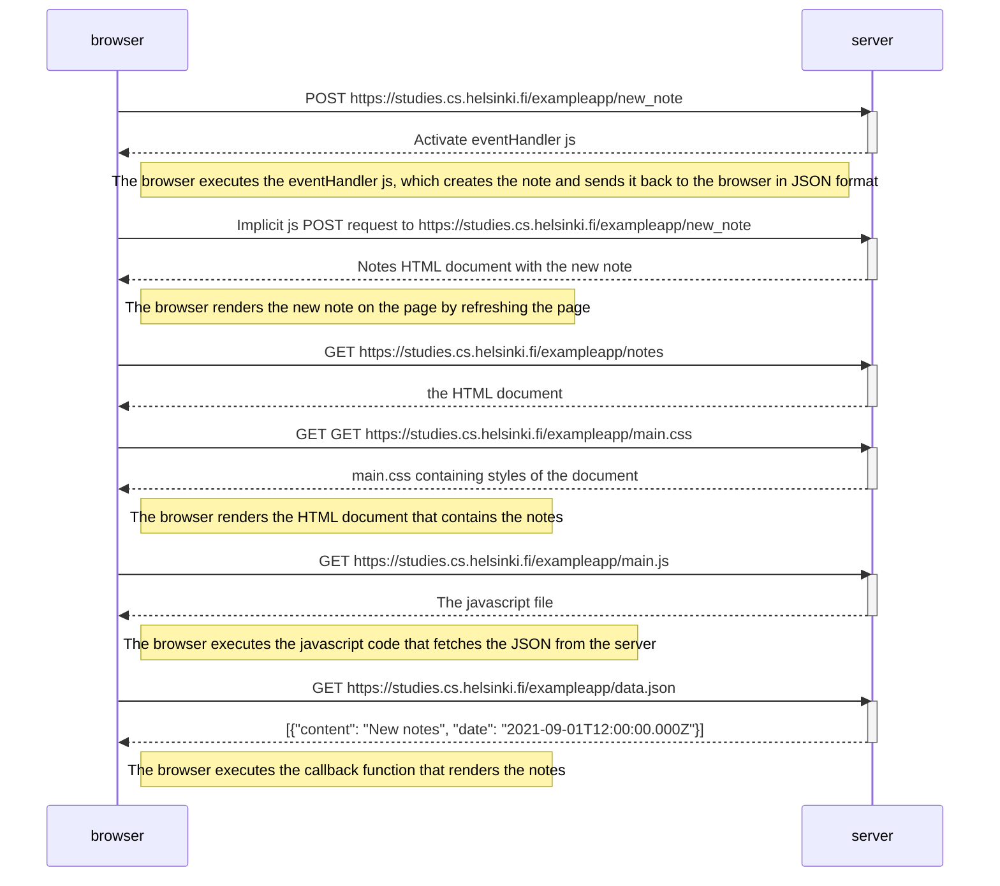

```mermaid
sequenceDiagram

    participant browser
    participant server
    
    browser->>server: POST https://studies.cs.helsinki.fi/exampleapp/new_note
    
    activate server
    server-->>browser: Activate eventHandler js;
    deactivate server
    
    note right of browser: The browser executes the eventHandler js, which creates the note and sends it back to the browser in JSON format

    browser->>server: Implicit js POST request to https://studies.cs.helsinki.fi/exampleapp/new_note
    activate server
    server-->>browser: Notes HTML document with the new note
    deactivate server

    note right of browser: The browser renders the new note on the page by refreshing the page

    browser->>server: GET https://studies.cs.helsinki.fi/exampleapp/notes
    activate server
    server-->>browser: the HTML document
    deactivate server

    browser->>server: GET GET https://studies.cs.helsinki.fi/exampleapp/main.css;
    activate server
    server-->>browser: main.css containing styles of the document
    deactivate server

    Note right of browser: The browser renders the HTML document that contains the notes

    browser->>server: GET https://studies.cs.helsinki.fi/exampleapp/main.js;
    activate server
    server-->>browser: The javascript file
    deactivate server

    Note right of browser: The browser executes the javascript code that fetches the JSON from the server

    browser->>server: GET https://studies.cs.helsinki.fi/exampleapp/data.json;
    activate server
    server-->>browser: [{"content": "New notes", "date": "2021-09-01T12:00:00.000Z"}]
    deactivate server

    note right of browser: The browser executes the callback function that renders the notes
```
